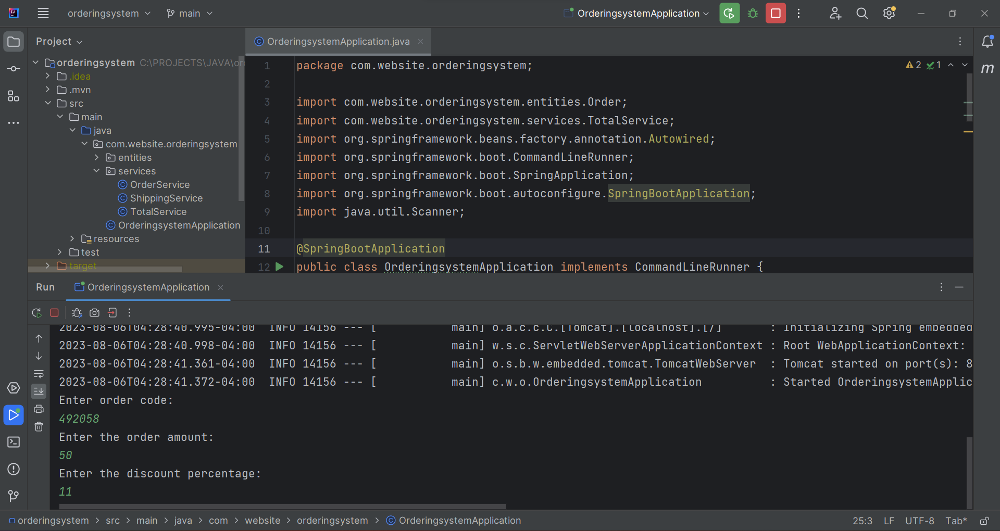

# Order Calculation System!

## An Order Calculation System using Spring Boot(Java framework) !

System to calculate the total value of an order, considering a percentage of discount and shipping. Calculating the total order value consists of applying the discount to the base order value and adding the shipping cost.

The discount percentage is entered by the user, as well as the base value of the order, and the identification code.
&nbsp;  
&nbsp;  
### The rule for calculating shipping costs is as follows:

- If the order value is below $100.00, shipping costs $20.00.
- If the order value is between $100.00 and $200.00, shipping costs $12.00.
- If it is $200 or more, shipping is free.
  
&nbsp;  

The logic for calculating the total order value is implemented by components (services), each with its responsibility, as described below:

- OrderService Service: responsible for operations related to orders.
- ShippingService Service: responsible for operations related to freight.

&nbsp;  
This solution is implemented in Java with Spring Boot. The output is shown in the application's terminal log. Each service is implemented as a component registered with @Service.
&nbsp;  
&nbsp;  

|               SCREENSHOT             
:------------------------------------------------:
 

